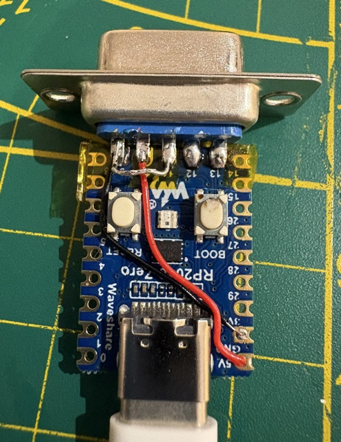
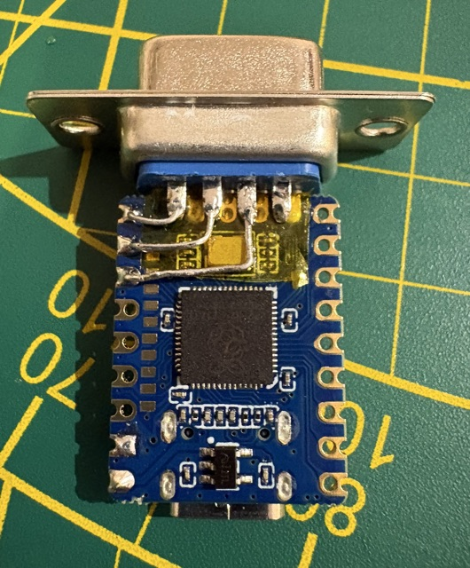

# USB adapter for Apple M0100 mouse using Waveshare RP2040 Zero

Original code found on https://geekhack.org/index.php?topic=74340.0 — seems to be based on https://github.com/GuilleAcoustic/QuadratureMouse and modified by https://github.com/Trasselfrisyr.

I ported the code to use an RP2040 Zero instead of a Sparkfun Pro Micro.

## Pictures of the adapter

